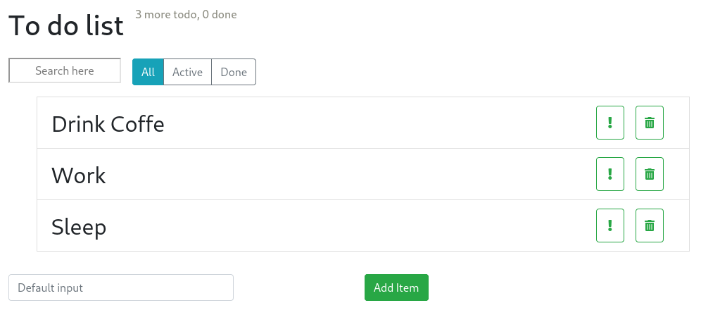

# [Simple React ToDo app](https://oldsav.github.io/react-deploy-todo/)

### `npm install gh-pages --save-dev`
### `git init`
### `git remote add origin https://github.com/oldsav/{page}.git`
### `git status`
### `git add .`
### `git commit -m "first commit"`
### `npm run deploy`
### `git push -u origin master`

